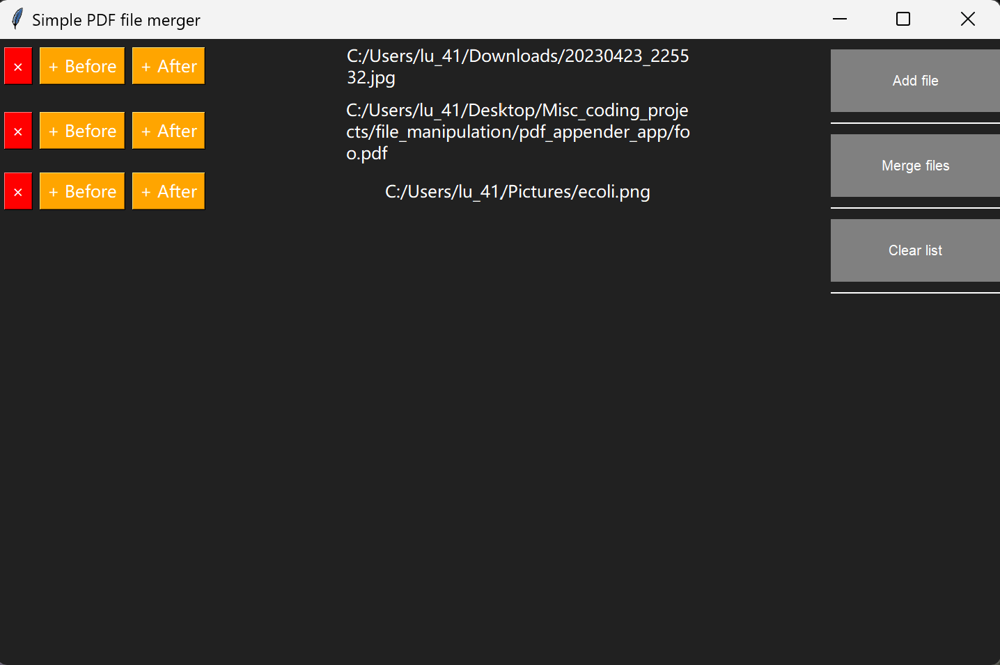

#  SimplePdfMerger

Worried about online pdf merger tools keeping your persnoal information or being needlessly overcomplicated to use? `SimplePdfMerger` solves this issue: a simple, *darkmode* pdf merging local windows desktop application written in less than 400 lines. The windows executable file `SimplePdfMerger.exe` and can also be found in the latest releases page.

## Installation
To run the app, simply download the executable from the latest release page and click on it when downloaded. The executable works on windows and the code hasn't been tested on other systems yet.

## Usage
PDFs, JPEGS, and PNGs can all be merged in any order into a pdf file within the user GUI:

On the right hand side, the first button "Add file" opens the file explorer when clicked, allowing the user to select a file to add to the end of the file list that can be merged into a pdf on the left hand side. The file can be a `.pdf`, `.png`, or `.jpg` file. The second button "Merge files" will attempt to convert all files in the filelist into pdfs and merge them into an output location chosen by the user in the file explorer. If (un)successful, a popup will be shown informing the user. The third button "Clear list" will simply clear the pdf list.

In the filelist, for each file, the filename will be shown in the right. On the left for each file, there are again three buttons. The first red x will remove the corresponding file from the filelist. The second button will open the file explorer to add a file before (above) the current file, while the second button will do the reverse.

*Developer's note: The `main_gui.py` script in `SimplePdfMerger` should ideally be split up but there were difficulties with the import system when using `pyinstaller`. Also, in the future the files in the filelsit should be made draggable should the user wants to reorder them.*