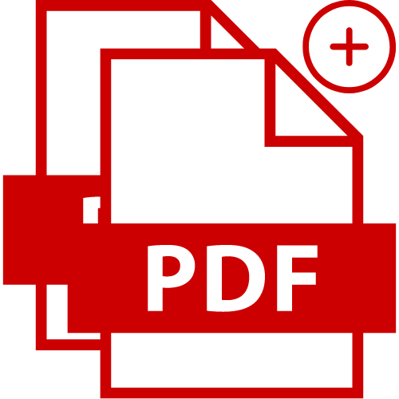

#  SimplePdfMerger

[]

A simple pdf merging windows desktop application written with tkinter. The windowsw executable file is `SimplePdfMerger.exe` and can also be found in the release.

Developer's note: The `main_gui.py` script in `SimplePdfMerger` should ideally be split up but there were difficulties with the import system when using `pyinstaller`